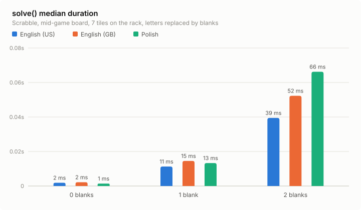

# @scrabble-solver/solver


The brains of Scrabble Solver.

## Benchmarks

`solve()` speed for a mid-game Scrabble position in English (US), English (GB), and Polish, grouped by the number of blank tiles on the rack.

Rerun the benchmarks and refresh the results below with:

```sh
bun run benchmark
```

<!-- benchmark-results:start -->



| Blanks | English (US) | English (GB) | Polish |
| --- | --- | --- | --- |
| 0 | 95 ms (1,559 results) | 113 ms (2,398 results) | 86 ms (1,826 results) |
| 1 | 1.1 s (7,546 results) | 1.2 s (11,680 results) | 1.1 s (15,289 results) |
| 2 | 7.9 s (25,659 results) | 10.1 s (39,286 results) | 13.3 s (70,691 results) |

Median of 5 runs (after 5 warmup runs)

<!-- benchmark-results:end -->
